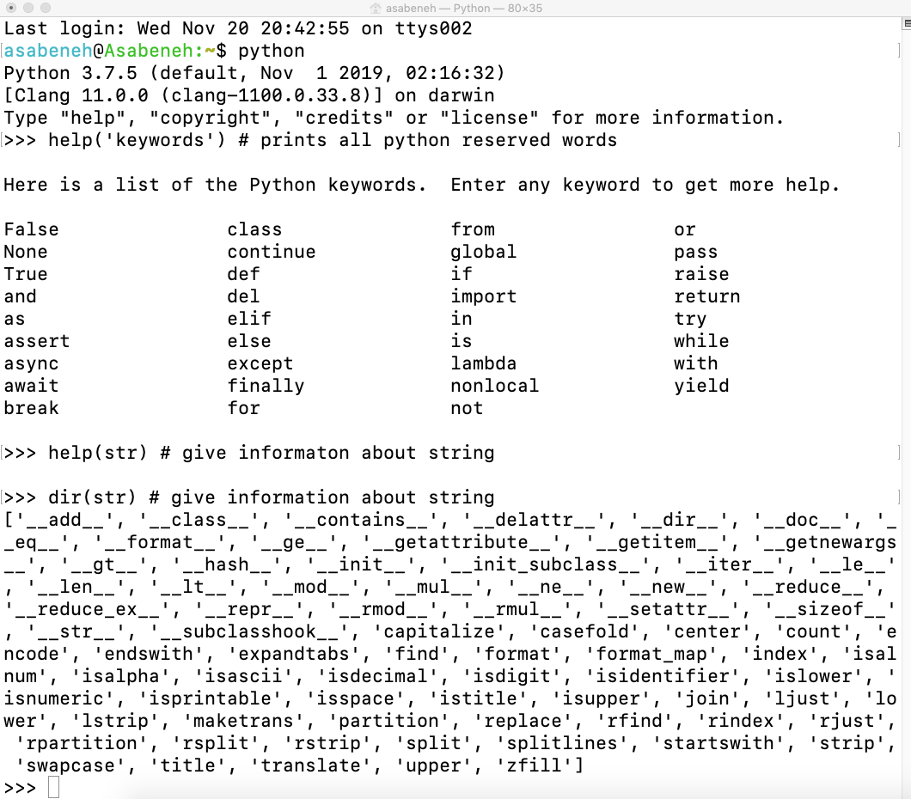

<div align="center">
  <h1> 30 Days Of Python: Day 2 - Variables, Builtin Functions</h1>
  <a class="header-badge" target="_blank" href="https://www.linkedin.com/in/asabeneh/">
  
  </a>
  <a class="header-badge" target="_blank" href="https://twitter.com/Asabeneh">
  
  </a>

<sub>Author:
<a href="https://www.linkedin.com/in/asabeneh/" target="_blank">Asabeneh Yetayeh</a><br>
<small> Second Edition: July, 2021</small>
</sub>

</div>

[<< Day 1](../readme.md) | [Day 3 >>](../03_Day_Operators/03_operators.md)


- [📘 Day 2](#-day-2)
  - [Built in functions](#built-in-functions)
  - [Variables](#variables)
    - [Declaring Multiple Variable in a Line](#declaring-multiple-variable-in-a-line)
  - [Data Types](#data-types)
  - [Checking Data types and Casting](#checking-data-types-and-casting)
  - [Numbers](#numbers)
  - [💻 Exercises - Day 2](#-exercises---day-2)
    - [Exercises: Level 1](#exercises-level-1)
    - [Exercises: Level 2](#exercises-level-2)

# 📘 Day 2

## Built in functions

En Python tenemos muchas funciones incorporadas. Las funciones están disponibles globalmente para su uso, lo que significa que puede hacer uso de las funciones incorporadas sin necesidad de importar o configurar. Algunas de las funciones incorporadas de Python más utilizadas son las siguientes: _print()_, _len()_, _type()_, _int()_, _float()_, _str()_, _input()_, _list()_, _dict()_, _min()_, _max()_, _sum()_, _sorted()_, _open()_, _file()_, _help()_, and _dir()_.

En la siguiente tabla podrá ver una lista exhaustiva de las funciones incorporadas de Python tomada de [python documentation](https://docs.python.org/3.9/library/functions.html).


Abramos el shell de Python y empecemos a utilizar algunas de las funciones incorporadas más comunes.


Practiquemos más utilizando diferentes funciones incorporadas



Como puedes ver en la terminal de arriba, Python tiene palabras reservadas. No usamos palabras reservadas para declarar variables o funciones. Cubriremos las variables en la siguiente sección.

Creo que a estas alturas ya estás familiarizado con las funciones incorporadas. Hagamos una práctica más de las funciones incorporadas y pasaremos a la siguiente sección.


## Variables

Las variables almacenan datos en la memoria del ordenador. En muchos lenguajes de programación se recomienda el uso de variables mnemotécnicas. Una variable mnemotécnica es un nombre de variable que se puede recordar y asociar fácilmente. Una variable se refiere a una dirección de memoria en la que se almacenan datos. El número al principio, el carácter especial y el guión no están permitidos al nombrar una variable. Una variable puede tener un nombre corto (como x, y, z), pero es muy recomendable un nombre más descriptivo (firstname, lastname, age, country)

Reglas de los nombres de las variables en Python

- A variable name must start with a letter or the underscore character
- A variable name cannot start with a number
- A variable name can only contain alpha-numeric characters and underscores (A-z, 0-9, y \_ )
- Variable names are case-sensitive (firstname, Firstname, FirstName and FIRSTNAME) are different variables)

Veamos los nombres de variables válidos:

```shell
firstname
lastname
age
country
city
first_name
last_name
capital_city
_if # si queremos utilizar la palabra reservada como variablefirst-name
year_2021
year2021
current_year_2021
birth_year
num1
num2
```

Nombres de variables no válidos:

```shell
first-name
first@name
first$name
num-1
1num
```

Utilizaremos el estilo estándar de nomenclatura de variables de Python que ha sido adoptado por muchos desarrolladores de Python. Los desarrolladores de Python utilizan la convención de nomenclatura de variables snake case(snake_case). Utilizamos el guion bajo después de cada palabra para una variable que contiene más de una palabra  (Ejem: first_name, last_name, engine_rotation_speed). El ejemplo siguiente es un ejemplo de denominación estándar de variables, el guión bajo es necesario cuando el nombre de la variable tiene más de una palabra.

Cuando asignamos un determinado tipo de datos a una variable, se llama declaración de variable. Por ejemplo, en el siguiente ejemplo mi nombre se asigna a la variable nombre. El signo igual es un operador de asignación. Asignar significa almacenar datos en la variable. El signo igual en Python no es una igualdad como en matemáticas.

_Example:_

```py
# Variables in Python
first_name = 'Asabeneh'
last_name = 'Yetayeh'
country = 'Finland'
city = 'Helsinki'
age = 250
is_married = True
skills = ['HTML', 'CSS', 'JS', 'React', 'Python']
person_info = {
   'firstname':'Asabeneh',
   'lastname':'Yetayeh',
   'country':'Finland',
   'city':'Helsinki'
   }
```

Utilicemos las funciones incorporadas _print()_ y _len()_. La función Print toma un número ilimitado de argumentos. Un argumento es un valor que podemos pasar o poner dentro del paréntesis de la función, ver el ejemplo siguiente.

**Example:**

```py
print('Hello, World!') # El texto Hello, World! es un argumento
print('Hello',',', 'World','!') # puede tomar múltiples argumentos. se pasaron 4 argumentos
print(len('Hello, World!')) # sólo necesita un argumento

```

Imprimamos y encontremos también la longitud de las variables declaradas en la parte superior:

**Example:**

```py
# Impresión de los valores almacenados en las variables

print('First name:', first_name)
print('First name length:', len(first_name))
print('Last name: ', last_name)
print('Last name length: ', len(last_name))
print('Country: ', country)
print('City: ', city)
print('Age: ', age)
print('Married: ', is_married)
print('Skills: ', skills)
print('Person information: ', person_info)
```

### Declaring Multiple Variable in a Line

También se pueden declarar múltiples variables en una línea:

**Example:**

```py
first_name, last_name, country, age, is_married = 'Asabeneh', 'Yetayeh', 'Helsink', 250, True

print(first_name, last_name, country, age, is_married)
print('First name:', first_name)
print('Last name: ', last_name)
print('Country: ', country)
print('Age: ', age)
print('Married: ', is_married)
```

Obteniendo el input del usuario usando la función incorporada _input()_. Asignemos los datos que obtenemos de un usuario en las variables first_name y age.
**Example:**

```py
first_name = input('What is your name: ')
age = input('How old are you? ')

print(first_name)
print(age)
```

## Data Types

Hay varios tipos de datos en Python. Para identificar el tipo de datos utilizamos la función _type_. Me gustaría pedirte que te concentres en entender muy bien los diferentes tipos de datos. Cuando se trata de programar, todo gira en torno a los tipos de datos. Introduje los tipos de datos al principio y lo hago de nuevo, porque cada tema está relacionado con los tipos de datos. Cubriremos los tipos de datos con más detalle en sus respectivas secciones.

## Checking Data types and Casting

- Comprobar los tipos de datos: Para comprobar el tipo de datos de ciertos datos/variables utilizamos este Ejemplo:

```py
# Different python data types
# Let's declare variables with various data types

first_name = 'Asabeneh'     # str
last_name = 'Yetayeh'       # str
country = 'Finland'         # str
city= 'Helsinki'            # str
age = 250                   # int, it is not my real age, don't worry about it

# Printing out types
print(type('Asabeneh'))     # str
print(type(first_name))     # str
print(type(10))             # int
print(type(3.14))           # float
print(type(1 + 1j))         # complex
print(type(True))           # bool
print(type([1, 2, 3, 4]))     # list
print(type({'name':'Asabeneh','age':250, 'is_married':250}))    # dict
print(type((1,2)))                                              # tuple
print(type(zip([1,2],[3,4])))                                   # set
```

- **Casting**: Conversión de un tipo de datos a otro tipo de datos. Usamos *`int()`*, *`float()`*, *`str()`*, *`list`*, *`set`* Cuando hacemos operaciones aritméticas los números del string deben ser convertidos primero a int o float, de lo contrario devolverá un error. Si concatenamos un número con una string, el número debe convertirse primero en una string. Hablaremos de la concatenación en la sección de Strings.

**Example:**

```py
# int to float
num_int = 10
print('num_int',num_int)         # 10
num_float = float(num_int)
print('num_float:', num_float)   # 10.0

# float to int
gravity = 9.81
print(int(gravity))             # 9

# int to str
num_int = 10
print(num_int)                  # 10
num_str = str(num_int)
print(num_str)                  # '10'

# str to int or float
num_str = '10.6'
print('num_int', int(num_str))      # 10
print('num_float', float(num_str))  # 10.6

# str to list
first_name = 'Asabeneh'
print(first_name)               # 'Asabeneh'
first_name_to_list = list(first_name)
print(first_name_to_list)            # ['A', 's', 'a', 'b', 'e', 'n', 'e', 'h']
```

## Numbers

Tipos de datos numéricos en Python:

1. Números enteros (negativos, cero y positivos) Ejemplo: ... -3, -2, -1, 0, 1, 2, 3 ...
2. Números en coma flotante (números decimales) Ejemplo: ... -3.5, -2.25, -1.0, 0.0, 1.1, 2.2, 3.5 ...
3. Números complejos Ejemplo: 1 + j, 2 + 4j, 1 - 1j

🌕 Eres increíble. Acabas de completar los desafíos del día 2 y estás dos pasos adelante en tu camino hacia la grandeza. Ahora haz algunos ejercicios para tu cerebro y tus músculos.

## 💻 Exercises - Day 2

### Exercises: Level 1

1. Inside 30DaysOfPython create a folder called day_2. Inside this folder create a file named variables.py
2. Write a python comment saying 'Day 2: 30 Days of python programming'
3. Declare a first name variable and assign a value to it
4. Declare a last name variable and assign a value to it
5. Declare a full name variable and assign a value to it
6. Declare a country variable and assign a value to it
7. Declare a city variable and assign a value to it
8. Declare an age variable and assign a value to it
9. Declare a year variable and assign a value to it
10. Declare a variable is_married and assign a value to it
11. Declare a variable is_true and assign a value to it
12. Declare a variable is_light_on and assign a value to it
13. Declare multiple variable on one line

### Exercises: Level 2

1. Check the data type of all your variables using type() built-in function
1. Using the _len()_ built-in function, find the length of your first name
1. Compare the length of your first name and your last name
1. Declare 5 as num_one and 4 as num_two
    1. Add num_one and num_two and assign the value to a variable total
    2. Subtract num_two from num_one and assign the value to a variable diff
    3. Multiply num_two and num_one and assign the value to a variable product
    4. Divide num_one by num_two and assign the value to a variable division
    5. Use modulus division to find num_two divided by num_one and assign the value to a variable remainder
    6. Calculate num_one to the power of num_two and assign the value to a variable exp
    7. Find floor division of num_one by num_two and assign the value to a variable floor_division
1. The radius of a circle is 30 meters.
    1. Calculate the area of a circle and assign the value to a variable name of _area_of_circle_
    2. Calculate the circumference of a circle and assign the value to a variable name of _circum_of_circle_
    3. Take radius as user input and calculate the area.
1. Use the built-in input function to get first name, last name, country and age from a user and store the value to their corresponding variable names
1. Run help('keywords') in Python shell or in your file to check for the Python reserved words or keywords

🎉 CONGRATULATIONS ! 🎉

[<< Day 1](../readme.md) | [Day 3 >>](../03_Day_Operators/03_operators.md)
